## Mesh (final submission)

Please fill this out and submit your work to Gradescope by the deadline.

### Output Comparison
Run the program with the specified `.ini` config file to compare your output against the reference images. The program should automatically save the output mesh to the `student_outputs/final` folder. Please take a screenshot of the output mesh and place the image in the table below. Do so by placing the screenshot `.png` in the `student_outputs/final` folder and inserting the path in the table.

- For instance, after running the program with the `subdivide_icosahedron_4.ini` config file, go to and open `student_outputs/final/subdivide_icosahedron_4.obj`. Take a screenshot of the mesh and place the screenshot in the first row of the first table in the column titled `Your Output`.
- The markdown for the row should look something like `| subdivide_icosahedron_4.ini |   |  |`

If you are not using the Qt framework, you may also produce your outputs otherwise so long as the output images show up in the table. In this case, please also describe how your code can be run to reproduce your outputs.

> Qt Creator users: If your program can't find certain files or you aren't seeing your output images appear, make sure to: 
> 1. Set your working directory to the project directory
> 2. Set the command-line argument in Qt Creator to `template_inis/final/<ini_file_name>.ini`

Note that your outputs do **not** need to exactly match the reference outputs. There are several factors that may result in minor differences, especially for certain methods like simplification where equal-cost edges may be handled differently.

Please do not attempt to duplicate the given reference images; we have tools to detect this.

| `.ini` File To Produce Output | Expected Output | Your Output |
| :---------------------------------------: | :--------------------------------------------------: | :-------------------------------------------------: | 
| subdivide_icosahedron_4.ini |  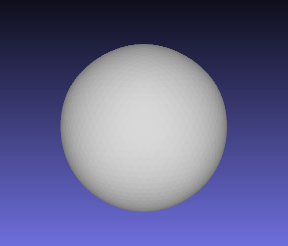 | 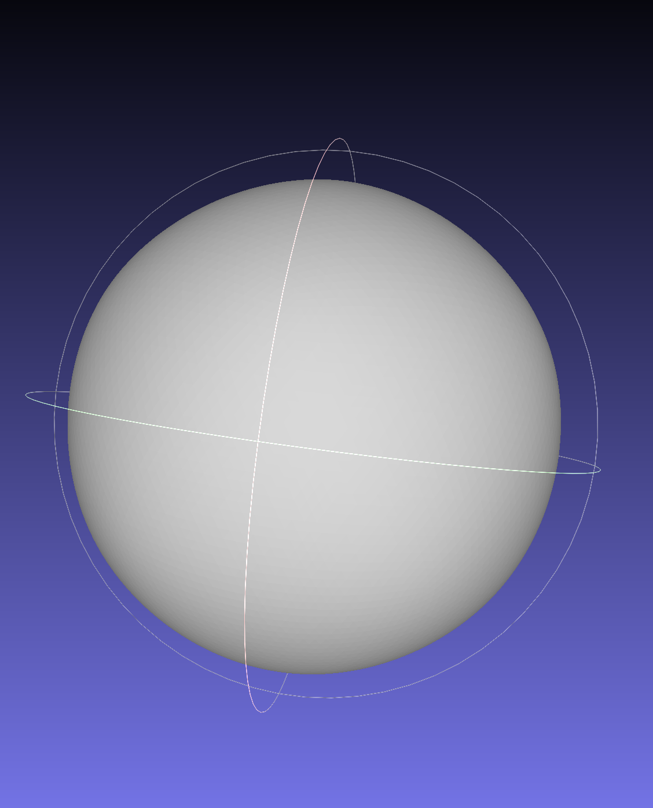 |
| simplify_sphere_full.ini |  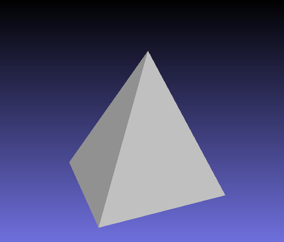 | 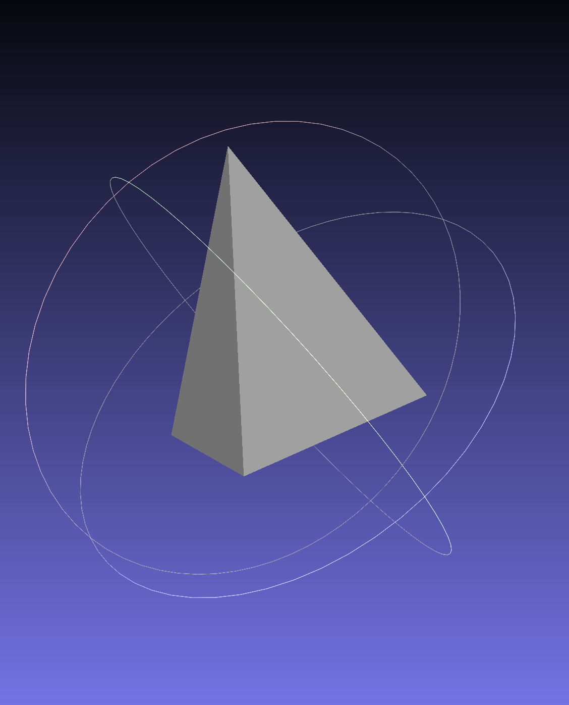 |
| simplify_cow.ini | 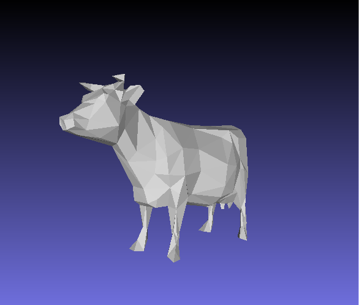 | 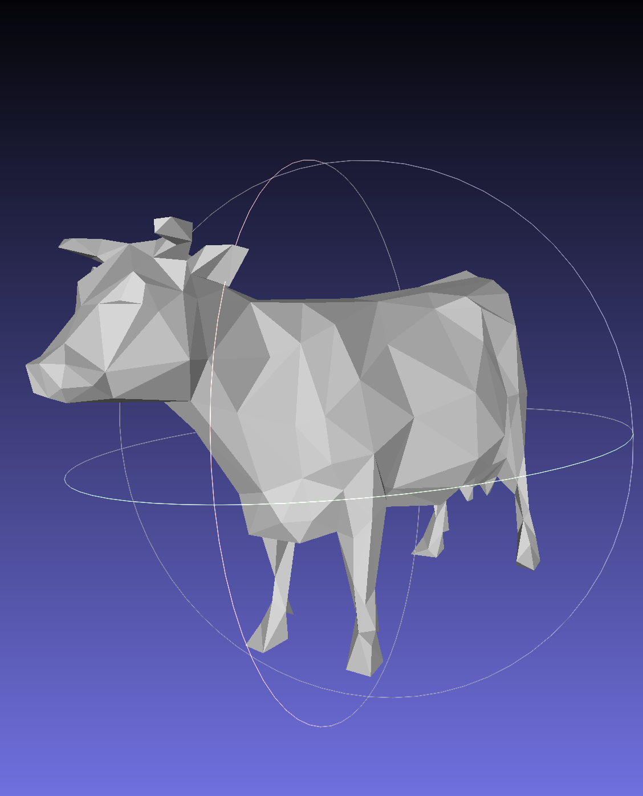 |

Output for Isotropic Remeshing (Note: if you did not implement this you can just skip this part)
| `.ini` File To Produce Output | Input Mesh .png | Remeshed Mesh .png |
| :---------------------------------------: | :--------------------------------------------------: | :-------------------------------------------------: | 
| remesh_peter.ini |  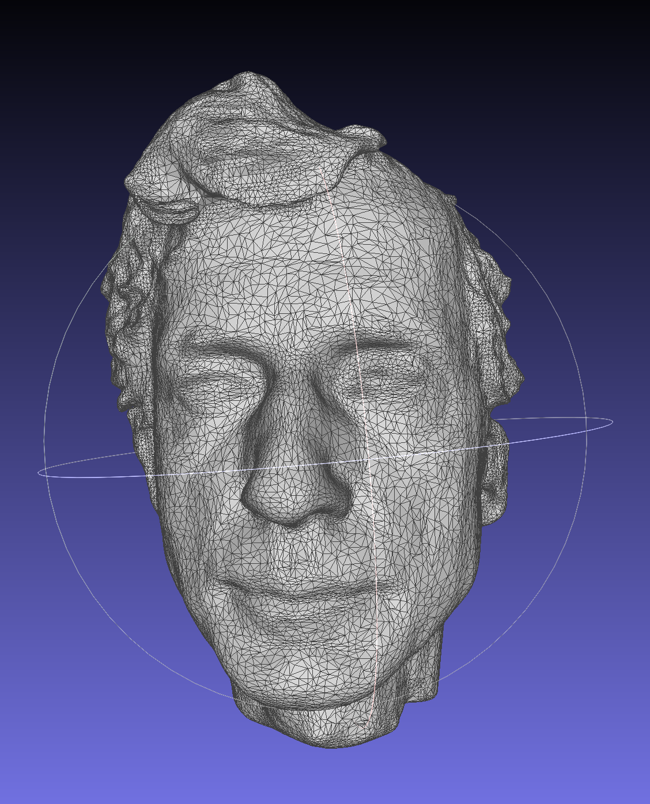 | 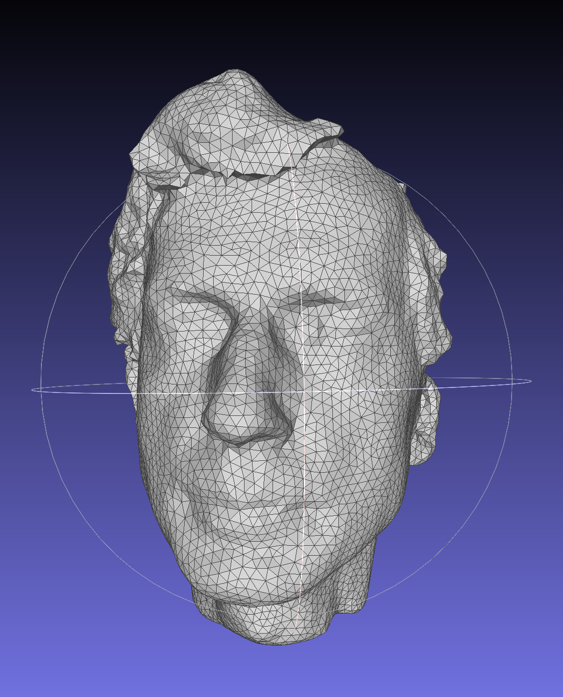 |
| remesh_peter.ini |  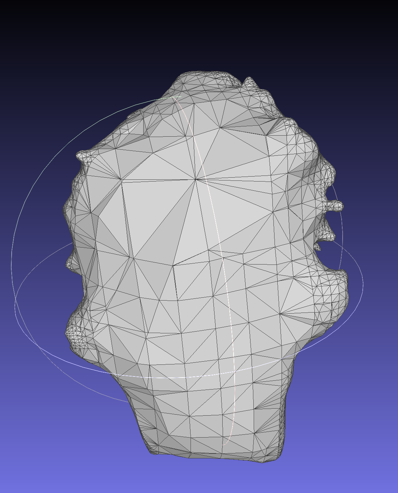 | 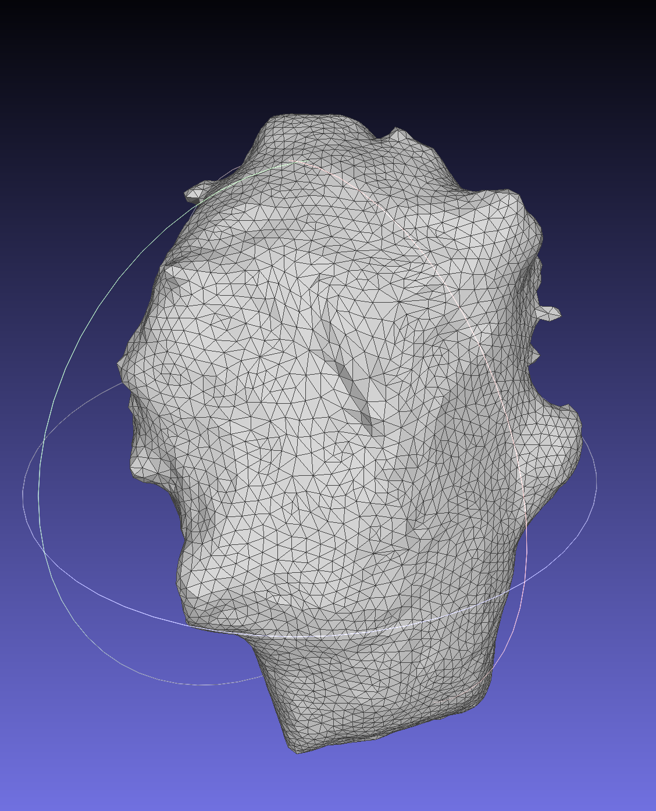 |
| remesh_cow.ini |  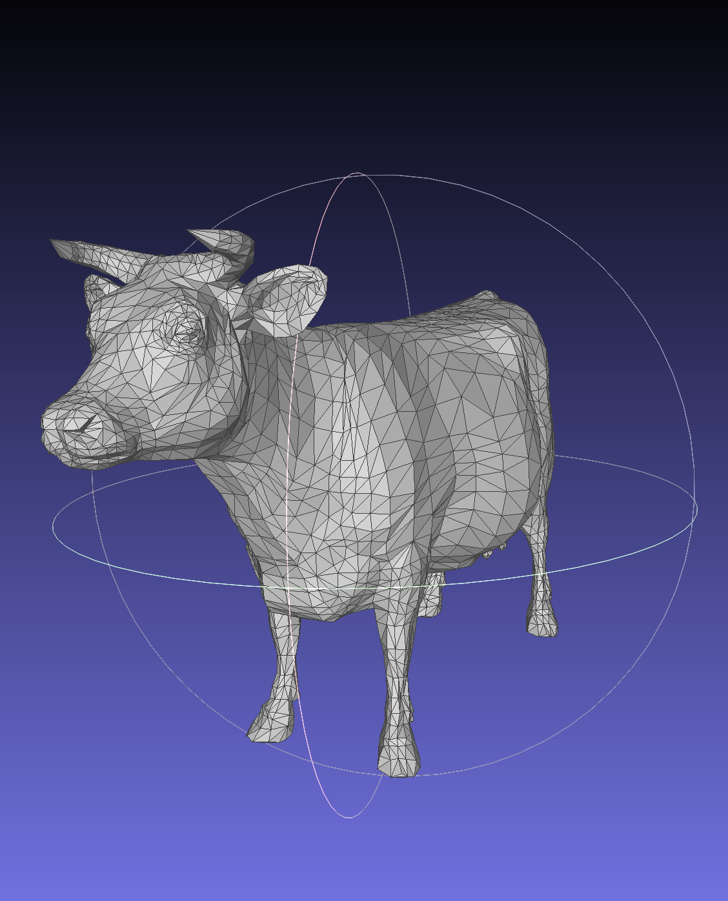 | 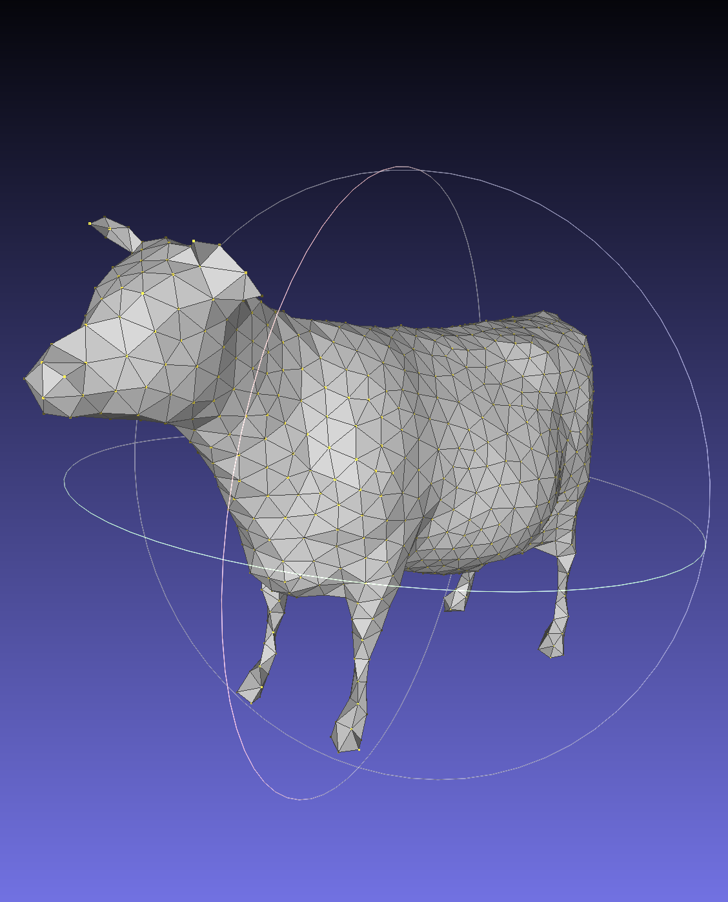 |

Output for Bilateral Mesh Denoising (Note: if you did not implement this you can just skip this part)
| `.ini` File To Produce Output | Noisy Mesh .png | Denoised Mesh .png |
| :---------------------------------------: | :--------------------------------------------------: | :-------------------------------------------------: | 
| <Path to your .ini file> |   |  |

Output for any other Geometry Processing Functions (Note: if you did not implement this you can just skip this part)
| `.ini` File To Produce Output | Input | Output |
| :---------------------------------------: | :--------------------------------------------------: | :-------------------------------------------------: | 
| <Path to your .ini file> |   |  |

### Design Choices

#### Mesh Data Structure 

I am using a half-edge mesh data structure. In order to keep track of the relevant
geometric and topological features, I keep unordered sets of edges, half-edges, 
faces, and an unordered map of vertices. The unordered map maps a vertex's index
from the parsed .obj file to the vertex struct itself.

Half-edges have pointers to other structs associated with it, such as the face it
belongs to, the edge it is a part of, and the source and destination vertices. 
Three half-edges make up a face in the style of a circular linked list, where 
a half-edge has a 'next' pointer pointing to the next side of the triangle.
Half-edges also have pointers to its 'twin', where a twin is another half-edge that connects
the same two vertices but goes in the opposite direction. Together, these twin
half-edges make up an edge in the mesh, and this data structure allows us to 
traverse the mesh by navigating through pointers. 

Aside from the half-edges, other features of the mesh are captured by Edge, 
Vertex, and Face structs. Edges reference one of the half-edges that make 
up an edge as well as data pertaining to the cost of collapsing that edge
used in simplification calculations. Vertices reference one of the half-edges
that point out from this vertex as well as the raw coordinates of the vertex.
Finally, faces also reference one of the half-edges that make up the face. 
We can navigate the vertices of the face by simply following the half-edge like
a linked list counter-clockwise.

#### Mesh Validator
Describe what your mesh validator checks for here. This can be a list.

1. Relevant fields of structs are not null.
    Half-edges: next, twin, source, destination, edge, and face
    Vertices: half-edge, coordinates
    Faces: half-edge
    Edge: half-edge
2. A half-edge's twin's twin is itself
3. Traversing through a half-edge's next field 3 times loops back to the same half-edge
4. A half-edge's source vertex is its twin's destinatio vertex
5. A half-edge's source vertex is its next's next's destination
6. A half-edge's edge's associated half-edge is either itself or its twin
7. A half-edge's edge is the same as its twin's edge
8. A half-edge's associated face's half-edge points to one of the half-edges
that make up the circular loop defining that face.
9. A vertex's half-edge's source is itself
10. A vertex's half-edge's twin's destination is itself
11. Every trio of half-edges that make up a face points to the same face
12. Every pair of half-edges that make up an edge points to the same edge

#### Run Time/Efficency 
Describe how you achieved efficient asymptotic running times for your geometry processing functions, including the data structures you used.

Since we can navigate to relevant local features
by following pointers, we can perform local operations in constant time.
We consider that each vertex will only have some constant number of neighbors,
meaning that operations that process each of a vertex's neighbors is 
considered constant time overall. Atomic operations can add and remove
elements from the global set of features (such as adding/removing edges).
Since I am using an unordered set, hashing element pointers allows us to
add/remove elements from unordered sets in constant time. 

For Loop Subdivision, my implementation creates a shallow copy of the 
set of vertices and the set of edges. I iterate through these sets 
at separate steps of the process, and each iteration is always linear 
time. Given that atomic operations are constant time, these iterations
that perform atomic operations are considered linear time, making 
loop subdivision linear time overall.

For Simplification, I also make shallow copies of the set of vertices 
and edges to iterate over as I calculate the cost of collapsing each edge.
When initializing the edge costs, I only iterate over the vertices and 
edges once, making it linear time.
I used a std::multiset to implement the priority queue that I use to 
collapse edges in order of minimum error. Since I need to extract from and 
insert edges into the queue, I made use of multiset iterators to make sure
that the overall time complexity for removing and inserting edges is log(n).
Since we are managing n edges, the overall time complexity after initializing
the edge costs is n*log(n).

For remeshing, there are several iterative steps to be applied to the mesh
such as splitting, collapsing, and updating vertex positions. I do each
of those steps separately by iterating through my set of edges and vertices,
achieving a time complexity of O(n) overall.

### Collaboration/References
Simplification and Remeshing papers given in lecture.
### Known Bugs
None
